<!-- ========================================================= -->
<!--                    HERO BANNER PLACEHOLDER                 -->
<!-- ========================================================= -->

<p align="center">
  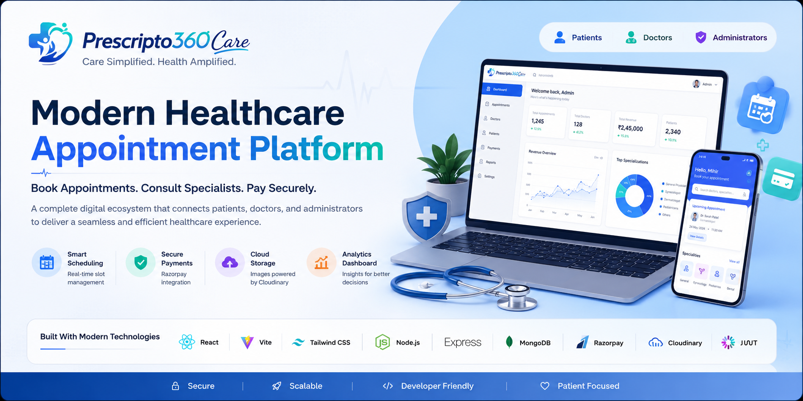
</p>

<h1 align="center">
🩺 Prescripto360Care
</h1>

<p align="center">
  <strong>Enterprise-Grade Healthcare Appointment Management Platform</strong>
</p>

<p align="center">
  Connecting <strong>Patients</strong>, <strong>Doctors</strong>, and <strong>Administrators</strong> through a secure, scalable, and modern digital healthcare ecosystem.
</p>

<p align="center">

  
  
  
  
  
  
  
  

</p>

<p align="center">

  <a href="https://prescripto-care-360.vercel.app/">
    
  </a>

  <a href="https://prescripto-care-360-admin.vercel.app/">
    
  </a>

  <a href="https://github.com/mihirgupta665/Prescripto_Care_360">
    
  </a>

</p>

---

# 📌 About the Project

Healthcare appointment booking is often fragmented across multiple channels, leading to scheduling conflicts, inefficient communication, and a poor user experience for both patients and healthcare providers.

**Prescripto360Care** addresses these challenges by providing a complete digital healthcare ecosystem where patients can seamlessly discover specialists, book appointments, complete secure online payments, and manage consultations. At the same time, doctors gain dedicated dashboards to manage appointments, earnings, and availability, while administrators oversee the entire platform through centralized analytics and management tools.

Built using the **MERN Stack**, the platform follows modern software engineering principles with modular architecture, role-based authentication, secure payment processing, cloud media management, and responsive user interfaces.

Whether viewed as a portfolio project or a production-ready foundation, **Prescripto360Care** demonstrates the implementation of scalable full-stack development practices in the healthcare domain.

---

# 🌍 Live Deployment

| Platform | Link |
|----------|------|
| 🌐 Patient Application | **https://prescripto-care-360.vercel.app/** |
| 👨‍⚕️ Admin & Doctor Dashboard | **https://prescripto-care-360-admin.vercel.app/** |
| ⚙️ Backend REST API | **https://prescripto-care-360.onrender.com/** |
| 💻 GitHub Repository | **https://github.com/mihirgupta665/Prescripto_Care_360** |

> **Note**
>
> Payments are integrated using **Razorpay Test Mode**.
> Test credentials can be used to simulate successful transactions without processing real payments.

---

---

# 🎬 Application Demo

> **A quick overview of the complete patient journey — Discover → Book → Pay → Confirm.**

<p align="center">

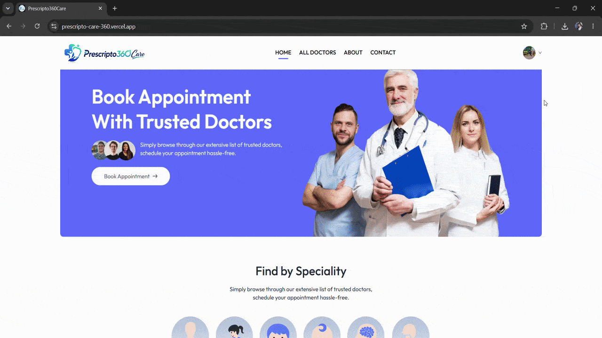

</p>

---

# 🎥 Project Walkthrough

> **A complete walkthrough of the Patient Application, Doctor Dashboard, and Administrator Dashboard.**

<p align="center">
<a href="./assets/PrescriptoVideo.mp4">
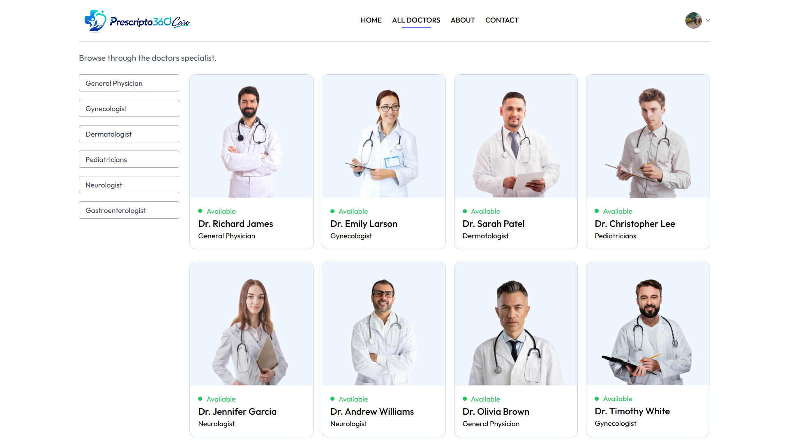
</a>
</p>

<p align="center">
<b>▶ Click the thumbnail above to watch the complete project walkthrough.</b>
</p>

---

# 📸 Application Showcase

Explore the complete healthcare ecosystem through the Patient Application, Administrator Dashboard, and Doctor Dashboard.

---

## 👤 Patient Application

| 🏠 Home Page | 👨‍⚕️ Doctors Directory |
|:------------:|:----------------------:|
| 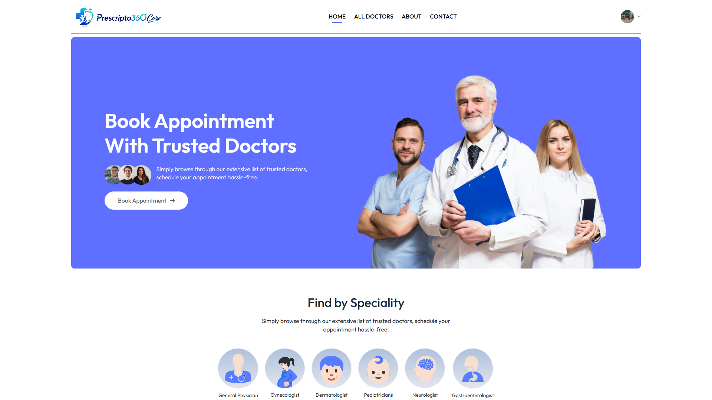 | 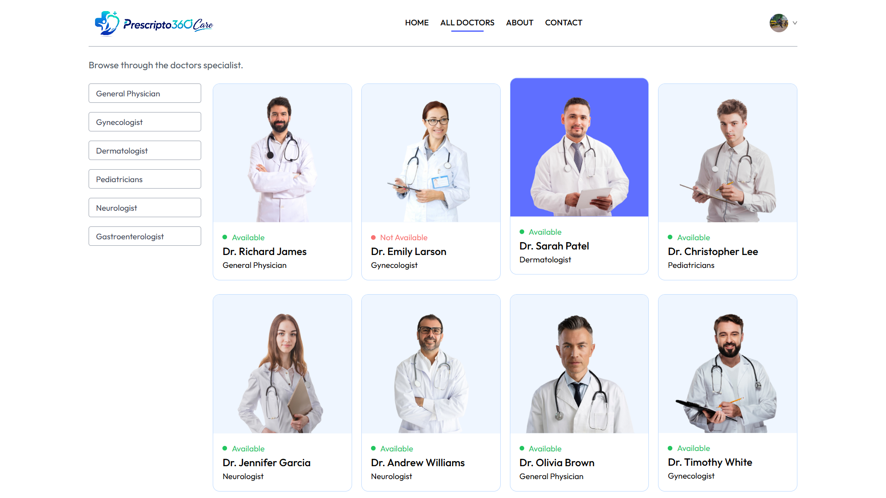 |

| 🩺 Doctor Profile & Booking | 💳 Secure Razorpay Payment |
|:---------------------------:|:--------------------------:|
| 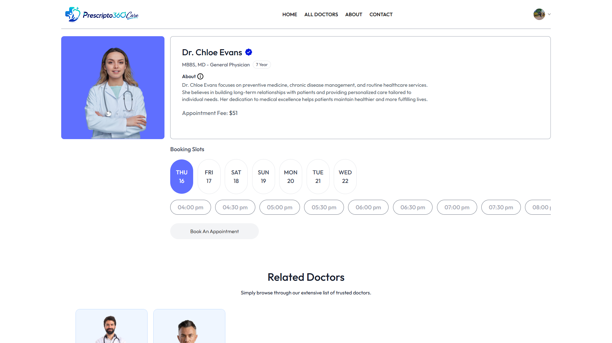 | 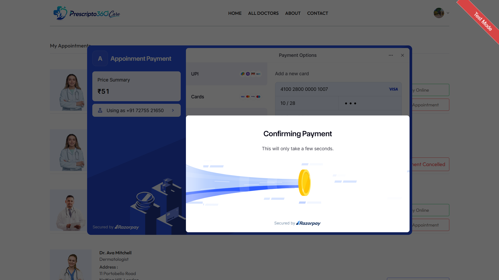 |

| 📖 My Appointments | 👤 My Profile |
|:------------------:|:-------------:|
| 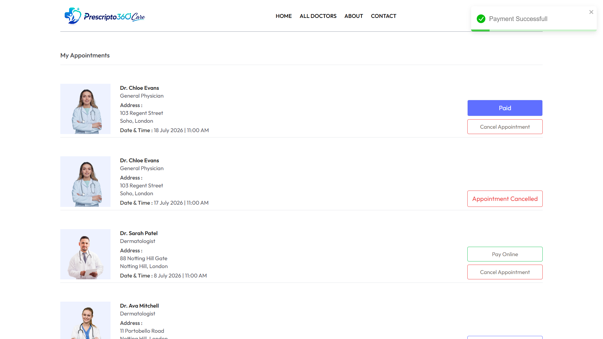 | 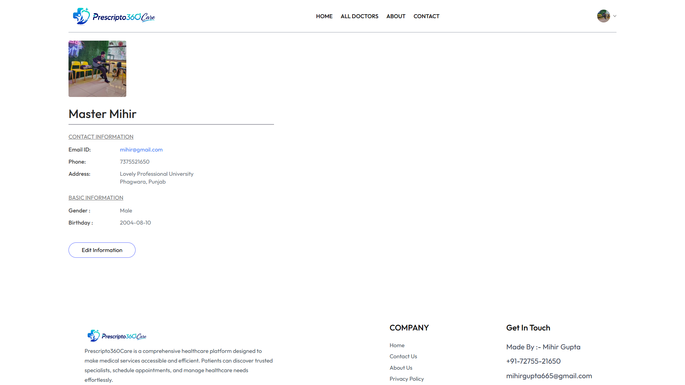 |

| 📱 Responsive Mobile View |
|:-------------------------:|
| 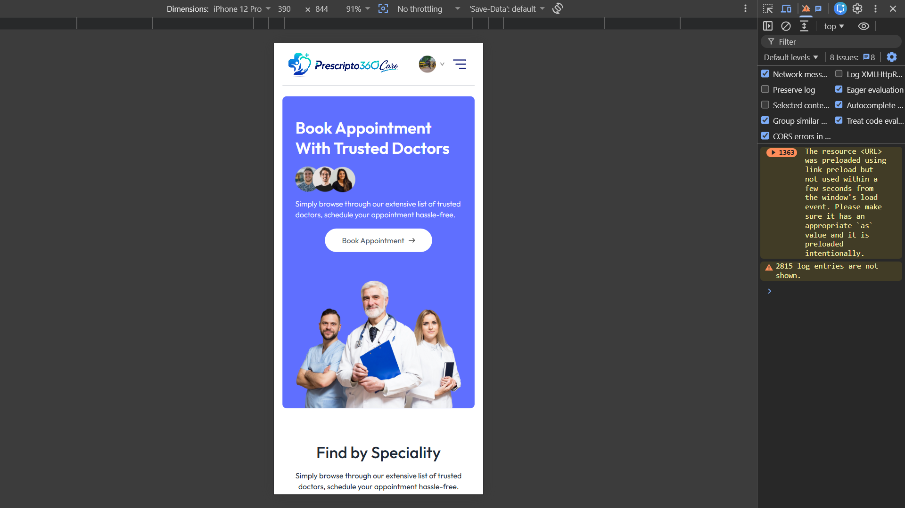 |

---

## 🛠 Administrator Dashboard

| 🏠 Admin Home | 📊 Dashboard |
|:-------------:|:------------:|
| 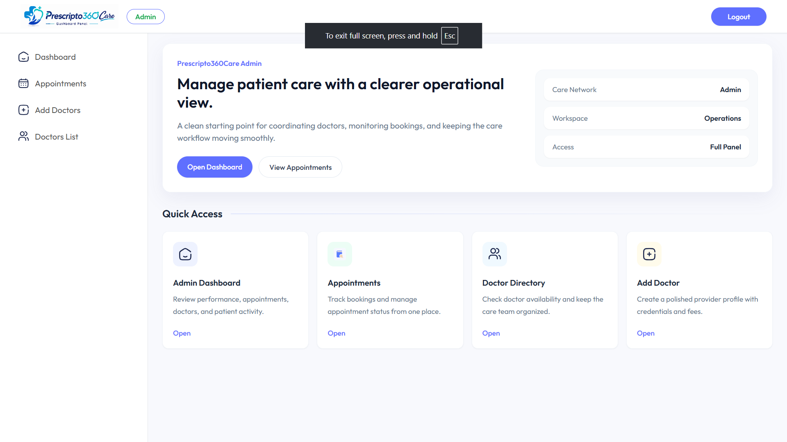 | 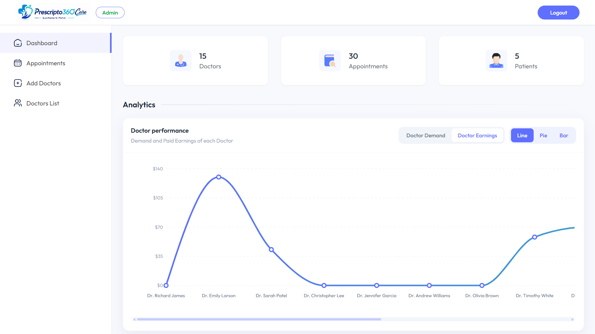 |

| 📅 Appointment Management | ➕ Add Doctor |
|:-------------------------:|:-------------:|
| 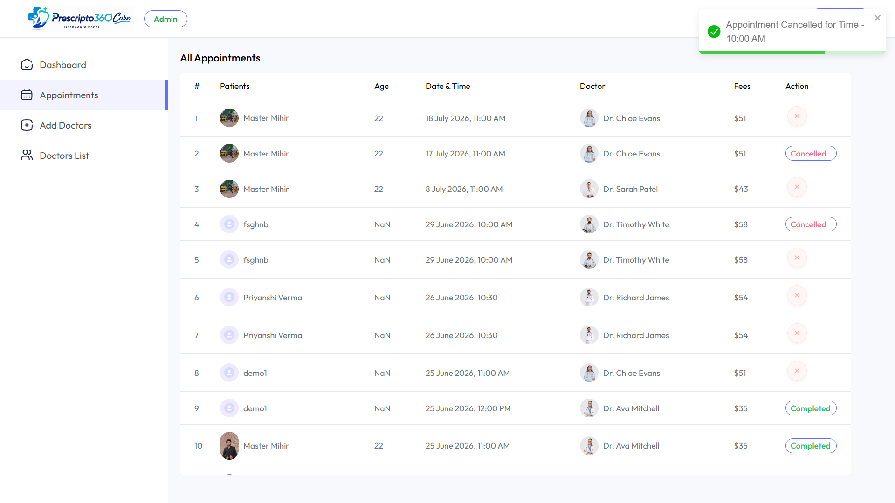 | 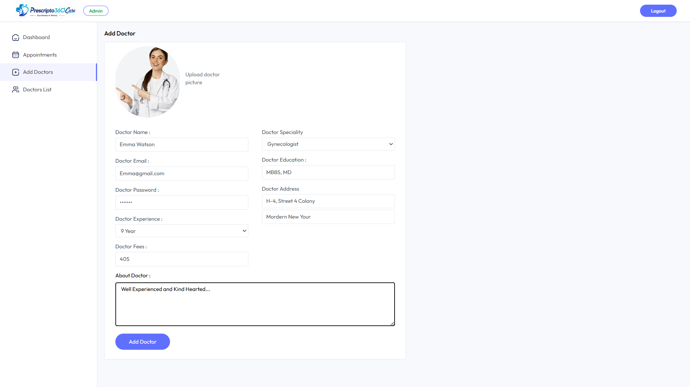 |

| 👨‍⚕️ Doctor Directory |
|:----------------------:|
| 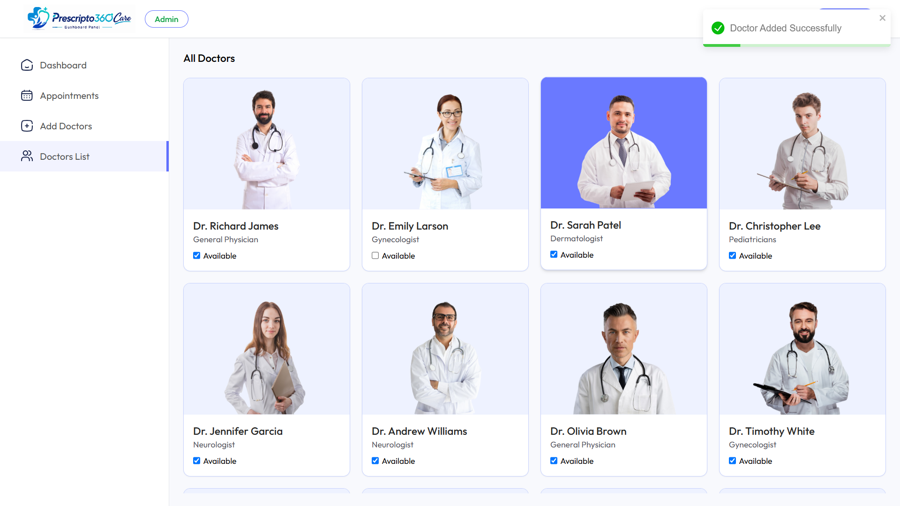 |

---

## 👨‍⚕️ Doctor Dashboard

| 📊 Dashboard | 📅 Appointments |
|:------------:|:---------------:|
| 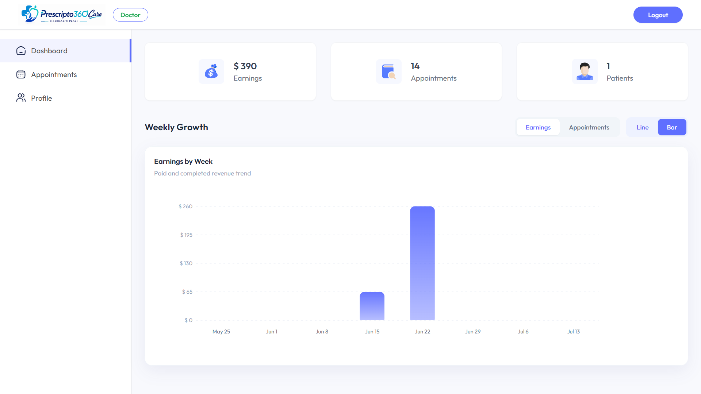 | 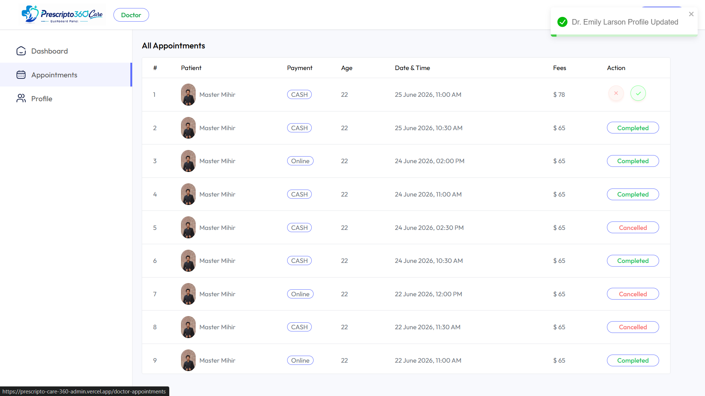 |

| 👤 Profile Management |
|:---------------------:|
| 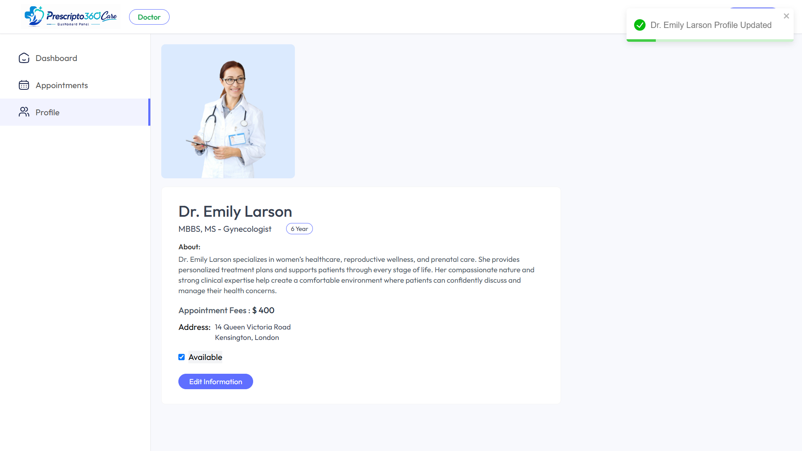 |

---

# ⭐ Why Prescripto360Care?

Healthcare appointment management often involves fragmented communication, manual scheduling, and disconnected workflows.

**Prescripto360Care** brings patients, doctors, and administrators together on a single platform, delivering a secure, efficient, and scalable healthcare ecosystem. The project demonstrates practical implementation of modern full-stack development concepts, including authentication, appointment scheduling, secure online payments, cloud media management, and role-based dashboards.

Designed with modular architecture and production-oriented practices, it emphasizes scalability, maintainability, security, and an intuitive user experience.

---

# ✨ Project Highlights

- ✅ Enterprise-Grade MERN Stack Architecture
- ✅ Three Dedicated User Roles (Patient, Doctor & Admin)
- ✅ Secure JWT Authentication & Authorization
- ✅ Password Encryption using Bcrypt
- ✅ Real-Time Appointment Slot Booking
- ✅ Razorpay Payment Gateway Integration
- ✅ Cloudinary Media Storage
- ✅ Responsive User Interface
- ✅ Analytics Dashboard
- ✅ RESTful API Architecture
- ✅ MongoDB Atlas Database
- ✅ Modular Backend Structure
- ✅ Production Deployment using Vercel & Render

---

# 📊 Project Metrics

| Category | Details |
|----------|---------|
| 🖥 Applications | Patient App + Admin/Doctor Dashboard |
| ⚙ Backend | Express REST API |
| 👥 User Roles | Patient • Doctor • Administrator |
| 🔐 Authentication | JWT + Bcrypt |
| 💳 Payment Gateway | Razorpay |
| ☁ Cloud Storage | Cloudinary |
| 🗄 Database | MongoDB Atlas |
| 📡 API Style | RESTful Architecture |
| 📈 Dashboard | Analytics & Appointment Insights |
| 🌍 Deployment | Vercel + Render |
| 📱 Responsive | Desktop • Tablet • Mobile |

---

- 📌 About the Project
- 🌍 Live Deployment
- 🎬 Application Demo
- 🎥 Project Walkthrough
- 📸 Application Showcase
  - 👤 Patient Application
  - 🛠 Administrator Dashboard
  - 👨‍⚕️ Doctor Dashboard
- ⭐ Why Prescripto360Care?
- ✨ Project Highlights
- 📊 Project Metrics
- 🏗 System Architecture
- ✨ Key Features
- 🛠 Technology Stack
- 📁 Project Structure
- ⚙ Core Functionalities
- 🔄 Appointment Booking Workflow
- 🔐 Environment Variables
- 🚀 Installation
- ▶ Running the Project
- 📦 Available Scripts
- 🌍 Deployment Guide
- 🚀 Future Enhancements
- 🧪 Project Learnings
- 🤝 Contributing
- 📄 License
- 👨‍💻 Author

---

# 🏗 System Architecture

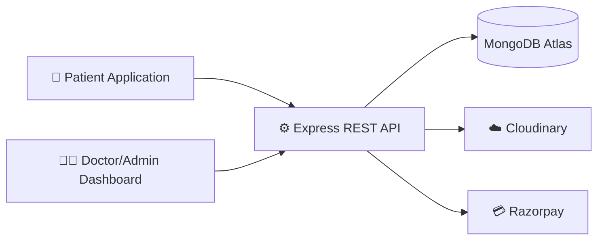
```mermaid
graph LR

A[👤 Patient Application]

B[👨‍⚕️ Doctor/Admin Dashboard]

C[⚙️ Express REST API]

D[(MongoDB Atlas)]

E[☁️ Cloudinary]

F[💳 Razorpay]

A --> C
B --> C
C --> D
C --> E
C --> F
```

---

# ✨ Key Features

Prescripto360Care provides a complete healthcare appointment ecosystem by serving three different user roles through dedicated dashboards and secure access control.

---

## 👤 Patient Portal

Empowering patients with a seamless healthcare booking experience.

| Feature | Description |
|---------|-------------|
| 🩺 Doctor Discovery | Browse specialists across multiple medical departments. |
| 🔍 Smart Filtering | Find doctors based on specialization. |
| 📅 Online Appointment Booking | Book appointments with real-time slot availability. |
| ⏰ Slot Management | Prevents overlapping bookings through server-side validation. |
| 💳 Secure Online Payments | Complete consultations securely using Razorpay. |
| 📋 Appointment History | View upcoming, completed, cancelled, and paid appointments. |
| 👤 Profile Management | Update personal information, address, and profile picture. |
| ☁ Cloud Image Upload | Store profile images securely using Cloudinary. |
| 📱 Responsive Interface | Optimized for Desktop, Tablet, and Mobile devices. |

---

## 👨‍⚕️ Doctor Dashboard

A dedicated workspace enabling doctors to efficiently manage consultations and appointments.

| Feature | Description |
|---------|-------------|
| 📊 Personal Dashboard | View appointments, earnings, and consultation statistics. |
| 📅 Appointment Management | Accept, cancel, or complete appointments. |
| 💰 Earnings Overview | Track consultation revenue. |
| 🟢 Availability Control | Enable or disable appointment availability instantly. |
| 👤 Profile Management | Update experience, fees, specialization, and profile details. |
| 🕒 Appointment Timeline | Organize scheduled consultations efficiently. |

---

## 🛠 Administrator Dashboard

Centralized management system for monitoring and controlling the entire platform.

| Feature | Description |
|---------|-------------|
| 📈 Analytics Dashboard | Platform-wide appointment and revenue statistics. |
| ➕ Doctor Management | Add and manage registered doctors. |
| 🩺 Doctor Availability | Enable or disable doctor booking status. |
| 📋 Appointment Monitoring | View and manage all appointments. |
| 👥 Platform Management | Monitor users, doctors, and healthcare operations. |
| 🔒 Administrative Control | Secure role-based access for platform administration. |

---

# 🛠 Technology Stack

The project follows a modern MERN architecture combined with cloud services, secure authentication, and third-party payment integration.

| Category | Technologies |
|-----------|--------------|
| 🎨 Frontend | React 19, Vite 8, Tailwind CSS |
| 🌐 Routing | React Router DOM |
| 📡 API Communication | Axios |
| ⚙ Backend | Node.js, Express.js |
| 🗄 Database | MongoDB Atlas, Mongoose |
| 🔐 Authentication | JSON Web Token (JWT), Bcrypt |
| ☁ Cloud Storage | Cloudinary |
| 💳 Payment Gateway | Razorpay |
| 📁 File Upload | Multer |
| 📊 Charts | Recharts |
| 🔔 Notifications | React Toastify |
| ✔ Validation | Validator.js |
| 🚀 Deployment | Vercel, Render |
| 💻 Version Control | Git & GitHub |

---

# 🧩 Software Architecture

The project follows a modular and scalable architecture where each layer is responsible for a specific business concern.

| Layer | Responsibility |
|--------|---------------|
| 🎨 Presentation Layer | Responsive React applications for Patients, Doctors, and Administrators |
| 🌐 API Layer | Express REST APIs handling incoming requests |
| 🔐 Authentication Layer | JWT verification and role-based authorization |
| ⚙ Business Layer | Controllers implementing application logic |
| 🗄 Data Layer | MongoDB collections managed through Mongoose |
| ☁ External Services | Razorpay Payment Gateway and Cloudinary Media Storage |

---

# 📁 Project Structure

```text
Prescripto360Care
│
├── frontend/                     # Patient Application
│   ├── public/
│   ├── src/
│   │
│   ├── assets/
│   ├── components/
│   ├── context/
│   ├── pages/
│   ├── App.jsx
│   └── main.jsx
│
├── admin/                        # Doctor & Admin Dashboard
│   ├── public/
│   ├── src/
│   │
│   ├── assets/
│   ├── components/
│   ├── context/
│   ├── pages/
│   ├── App.jsx
│   └── main.jsx
│
├── backend/                      # Express Backend
│   ├── config/
│   ├── controllers/
│   ├── middlewares/
│   ├── models/
│   ├── routes/
│   ├── utils/
│   ├── server.js
│   └── package.json
│
│
├── assets/
│   ├── screenshots/
|
└── README.md
```

---

# ⚙ Core Functionalities

Beyond a standard CRUD application, Prescripto360Care incorporates several production-inspired features that improve scalability, maintainability, and user experience.

---

## 🔐 Authentication & Authorization

The platform implements secure authentication using **JSON Web Tokens (JWT)** and **Bcrypt** password hashing.

### Role-Based Access Control

- 👤 Patient Authentication
- 👨‍⚕️ Doctor Authentication
- 🛠 Administrator Authentication

Each protected route validates the incoming JWT before granting access to authorized resources.

---

## 📅 Smart Appointment Booking Engine

The booking system validates doctor availability before confirming appointments.

### Booking Logic

1. Patient selects a doctor.
2. Patient chooses an available date.
3. Available consultation slots are generated dynamically.
4. Backend validates slot availability.
5. Appointment is temporarily reserved.
6. Successful payment confirms booking.
7. Slot becomes unavailable for future bookings.

This approach eliminates double-booking and maintains scheduling consistency.

---

## 💳 Secure Payment Processing

The platform integrates **Razorpay** for secure consultation fee payments.

Payment workflow includes:

- Order creation through backend APIs
- Secure Razorpay Checkout
- Signature verification
- Payment validation
- Appointment confirmation
- Paid status update

---

## ☁ Cloud Image Management

Doctor and patient profile images are securely uploaded using **Multer** and stored in **Cloudinary**.

Benefits include:

- Optimized cloud storage
- Faster image delivery
- Reduced backend storage requirements
- Secure media management

---

## 📊 Analytics Dashboard

Administrators and doctors receive interactive dashboards displaying meaningful platform insights.

Dashboard metrics include:

- Total Appointments
- Registered Doctors
- Platform Revenue
- Completed Consultations
- Appointment Trends
- Personal Earnings (Doctors)

---

## 🔄 Appointment Booking Workflow

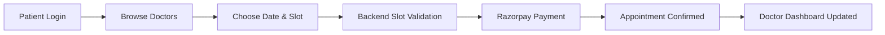
```mermaid
flowchart LR

A[Patient Login]

B[Browse Doctors]

C[Choose Date & Slot]

D[Backend Slot Validation]

E[Razorpay Payment]

F[Appointment Confirmed]

G[Doctor Dashboard Updated]

A --> B
B --> C
C --> D
D --> E
E --> F
F --> G
```

---

# 🔐 Environment Variables

To run the project locally, create the following environment files inside their respective directories.

---

## Backend (`backend/.env`)

```env
PORT=4000

MONGODB_URI=your_mongodb_connection_string
MONGODB_DB_NAME=prescripto360care

JWT_SECRET=your_super_secret_key

ADMIN_EMAIL=admin@example.com
ADMIN_PASSWORD=your_admin_password

CLOUDINARY_NAME=your_cloudinary_name
CLOUDINARY_API_KEY=your_cloudinary_api_key
CLOUDINARY_SECRET_KEY=your_cloudinary_secret

RAZORPAY_KEY_ID=your_razorpay_key
RAZORPAY_KEY_SECRET=your_razorpay_secret

CURRENCY=INR
```

---

## Frontend (`frontend/.env`)

```env
VITE_BACKEND_URL=http://localhost:4000
VITE_RAZORPAY_KEY_ID=your_razorpay_key
```

---

## Admin Dashboard (`admin/.env`)

```env
VITE_BACKEND_URL=http://localhost:4000
```

---

# 🚀 Getting Started

Follow the steps below to run Prescripto360Care on your local machine.

---

## 1️⃣ Clone the Repository

```bash
git clone https://github.com/mihirgupta665/Prescripto_Care_360.git
```

```bash
cd Prescripto360Care
```

---

## 2️⃣ Install Dependencies

### Backend

```bash
cd backend
npm install
```

### Patient Application

```bash
cd ../frontend
npm install
```

### Admin Dashboard

```bash
cd ../admin
npm install
```

---

## ▶ Running the Project

Open **three terminal windows**.

### Terminal 1

Backend

```bash
cd backend
npm run server
```

Runs at

```
http://localhost:4000
```

---

### Terminal 2

Patient Application

```bash
cd frontend
npm run dev
```

Runs at

```
http://localhost:5173
```

---

### Terminal 3

Doctor & Admin Dashboard

```bash
cd admin
npm run dev
```

Runs at

```
http://localhost:5174
```

---

# 📦 Available Scripts

## Backend

| Command | Description |
|----------|-------------|
| npm start | Starts production server |
| npm run server | Starts development server with Nodemon |

---

## Frontend & Dashboard

| Command | Description |
|----------|-------------|
| npm run dev | Starts Vite Development Server |
| npm run build | Creates Production Build |
| npm run preview | Preview Production Build |
| npm run lint | Runs ESLint |

---

# 🌍 Deployment

The application is deployed using a modern cloud architecture.

| Component | Platform |
|------------|----------|
| 🌐 Patient Application | Vercel |
| 👨‍⚕️ Doctor/Admin Dashboard | Vercel |
| ⚙ Backend API | Render |
| 🗄 Database | MongoDB Atlas |
| ☁ Media Storage | Cloudinary |
| 💳 Payment Gateway | Razorpay |

---

## Deployment Configuration

### Backend

```
Platform : Render

Root Directory : backend

Build Command : npm install

Start Command : npm start
```

---

### Frontend

```
Platform : Vercel

Framework : Vite

Root Directory : frontend
```

---

### Admin Dashboard

```
Platform : Vercel

Framework : Vite

Root Directory : admin
```

---

# 🚀 Future Improvements

Although fully functional, several enhancements can further improve the platform.

- 📅 Google Calendar Integration
- 📩 Email Appointment Confirmation
- 📱 SMS Notifications
- 🔔 Real-Time Appointment Reminders
- 💬 Patient–Doctor Chat
- 🎥 Video Consultation
- ⭐ Doctor Reviews & Ratings
- 🌐 Multi-Language Support
- 🌙 Dark Mode
- 📊 Advanced Analytics Dashboard
- 🤖 AI-Based Doctor Recommendation
- 📄 Downloadable Medical Prescriptions

---

# 🧪 Project Learnings

Building Prescripto360Care provided practical experience in designing and developing a production-inspired full-stack healthcare platform.

Key areas explored include:

- Designing scalable MERN architecture
- Implementing role-based authentication
- Building secure REST APIs
- Integrating third-party payment gateways
- Managing cloud-based media uploads
- Working with MongoDB relationships
- Building responsive interfaces
- Deploying multi-service applications
- Managing environment variables securely
- Structuring maintainable backend code

---

# 🤝 Contributing

Contributions are always welcome.

If you have ideas, improvements, or bug fixes, feel free to contribute.

1. Fork the repository

2. Create a feature branch

```bash
git checkout -b feature/awesome-feature
```

3. Commit your changes

```bash
git commit -m "Add awesome feature"
```

4. Push to GitHub

```bash
git push origin feature/awesome-feature
```

5. Open a Pull Request

---

# 📄 License

This project is released under the **MIT License**.

You are free to use, modify, and distribute this project for educational and personal purposes.

---

# 👨‍💻 Author

<div align="center">

## Mihir Gupta

**Full Stack Developer • AI/ML Enthusiast • Software Engineer**

Passionate about building scalable applications, solving real-world problems, and continuously learning modern technologies.

---

# ⭐ Support the Project

If you found this project useful or inspiring,

consider giving it a **⭐ Star** on GitHub.

It helps the project reach more developers and motivates continued development of high-quality open-source software.

---

### Let's Connect

[GitHub](https://github.com/mihirgupta665)

[LinkedIn](https://www.linkedin.com/in/mihir-gupta-980173299/)

</div>

---

<div align="center">

### ⭐ Thank you for visiting Prescripto360Care ⭐

**Built with ❤️ using the MERN Stack**

</div>